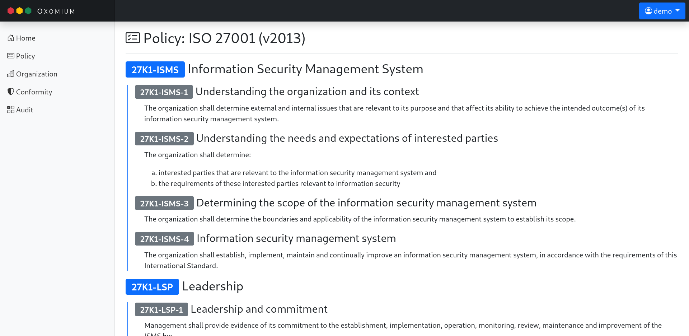
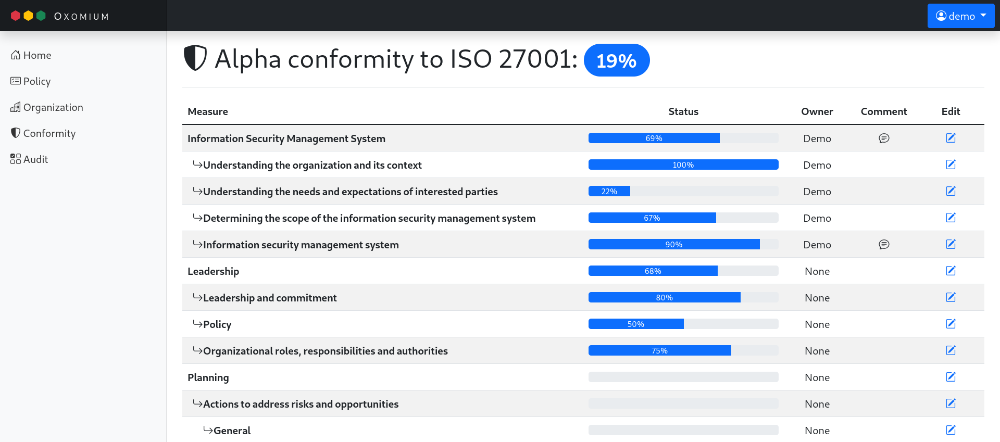
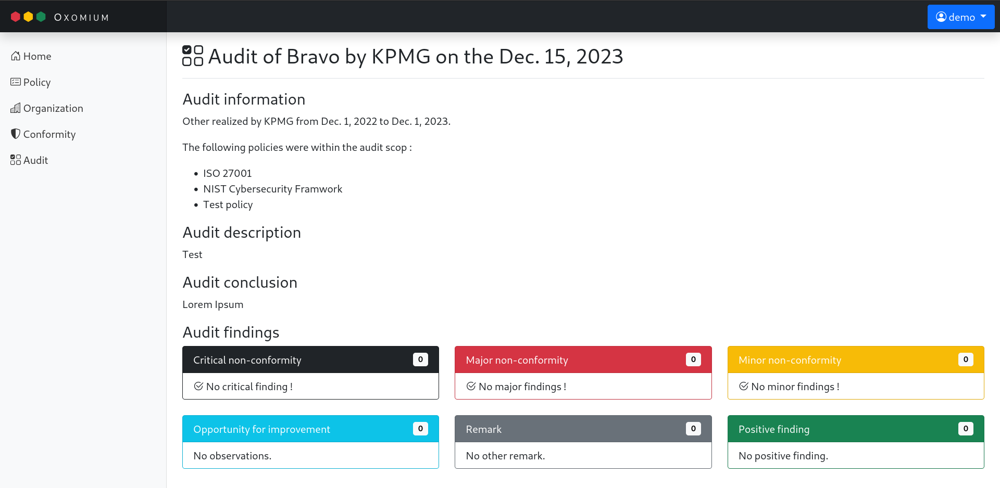

## Oxomium

Oxomium has been disigned to help cybersecuirty team to handle the conformity of Organizations to standard or internal policy.
It has been design to be simple to use and avoid compex spreadsheet. 

Oxomium is provided with a basic set of features at firest but will be extanded with time. 

The OpenSource oaspect is fondamental for me and will (I hop) help to improve the tool quickly with the feedback of several users. 

### Conformity management

Oxomium is able to help you to track the conformity of organisation to security policy.
The policy could be a default one (ISO27001 and NIST are provided) or your own policy. 

 *Screenshot of the ISO27001 policy description*

 *Screenshot of the conformity of the Alpha organisation to ISO27001 policy*

### Audit management

Oxomium allow you to register your audit and the indings associated. 

 *Screenshot of an audit summary infludings findings synthesis*

### Roadmap

I have plan a road map to improve the tool progressibly. I will use the GitHub milstones to show the progress of the developement. 

The plan for the next vertion is the following:
- [x] Add default dataset for ISO27001 and NIST policy
- [x] Management of the audit findings
- [ ] Support of Actions and Actions Plan  attatche to an andit finginds, a non-conformity (or both). 
- [ ] Executive dashbord and email notification for deadline management.
- [ ] Security survey for external suplyer (with magic link).
- [ ] Support of manual Indicator (KPI).
- [ ] Support of automatic Indicator with automatic data gatering from API.

### Contact

For any issue related to the project, pleas don't easitate to reatch me with GitHub issue !
All help can be usefull, event a simple user feedback. 
